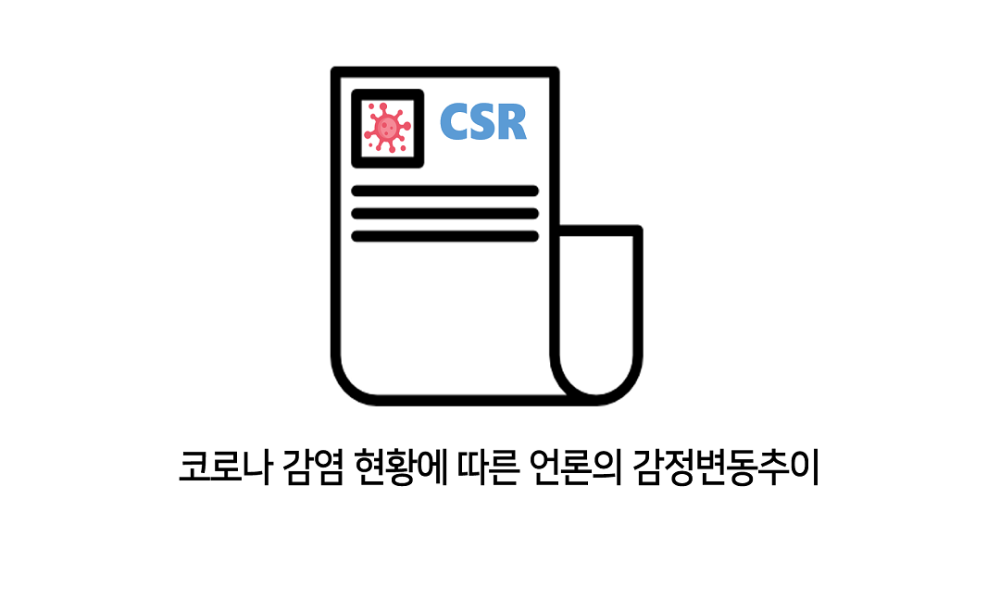
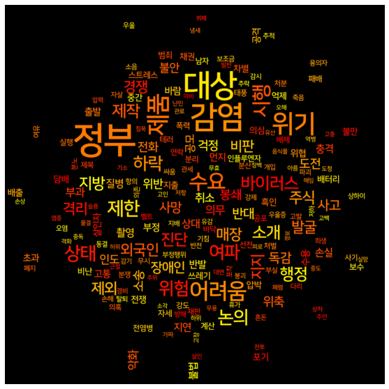

# CSR

  
  
  
:bar_chart:Changes in media Sentiment according to coRona infection status      
코로나 감염 현황에 따른 언론의 감정변동추이    
\#DeepLearning\#NLP\#emotional analysis\#Web Crawling    

 

현재 가장 큰 이슈인 팬대믹(pandamic) 코로나 바이러스 기사에서 정치편향적이고 불필요한 정보를 명시하여 사회분란을 조장하는 사례가 발생하고 있습니다.   
같은 내용의 사건을 기사로 내는데 언어표현은 민중심리를 좌지우지하는데 많은 책임감을 지닙니다. 한국기자협회의 윤리강령 제 2항 ‘공정보도’: ‘우리는 뉴스를 보도함에 있어서 진실을 존중하여 정확한 정보만을 취사선택하며, 엄정한 객관성을 유지한다.’ 라는 내용에 부합하게 정당한 보도가 이루어지고 있는 것인지 AI기술을 사용하여 그 실태를 조사합니다.    

# Dataset
공공API의 두 XML파일을 사용합니다.  
`보건복지부_코로나19 감염_현황`누적 확진자수, 사망자수, 검사자수, 누적 확진률 등의 코로나 감염 현황 정보  
`한국언론진흥재단_뉴스빅데이터_메타데이터_코로나`일자, 언론사, 제목, 키워드, 본문 등의 코로나 관련 뉴스 분석 자료

위 두 자료를 이용하여 3개월간의 코로나 키워드 뉴스 데이터를 csv파일 형태로 받았습니다.  
원하는 칼럼(일자/본문/키워드)만 슬라이싱하여 새로운 데이터셋을 구성했습니다.  

# Related Work  

+ NLP(Natural Language Processing)  
인간의 언어를 기계가 모사할 수 있도록 하는 인공지능의 한 분야입니다. 언어의 형태소를 분석하고 구절 단위를 분석합니다. 기사의 본문을 자연어 분석(토큰화, 감정사전 대조)을 통해 핵심 단어를 추출하고 감정변화의 추이를 그려봅니다. 우리는 KoNLPy라는 한국어 형태소분석기를 사용했습니다.     
+KoNLPy가 지원하는 모듈 여러 개(Hannanum, Okt 등)를 테스트하며 어떤게 가장 감성탐지에 효과적일지 판단했습니다. 
+ Emotional analysis : 감정분석  
한국어 감정 사전을 이용하여 기사를 세 가지 기준으로 감정을 분석합니다. 14,182개의 한글감성어를 지원하는 EmoLex감성낱말사전을 사용하여 긍부정 감정, 8 감정을 분석했습니다. 객관성주관성분석은 textblob모듈을 사용했습니다  
+긍부정분석  
+8감정(분노, 기쁨 등)분석  
+객관성주관성분석   
+ Web Crawling    
 인증키를 받아 공공API 데이터를 가져와 분석합니다. 코로나 감염 현황과 코로나 관련 기사 데이터셋을 받아와 감정분석, 그래프 시각화에 필요한 정보만 슬라이싱하여 사용했습니다.  
    

**분석결과를 보고싶다면 `CSV.docx`파일을 꼭 확인바랍니다.**  

# Ending  
윤리강령에 부합하여 이루어지는지 데이터 분석을 통해 살펴보았습니다. 편향적인 감정을 이끌어내는 '미끼단어'를 파악하여 많은 사람들이 인지할 수 있게 시각화했습니다. 객관성을 지키고 정당한 사실을 알리는 의무를 가진 언론의 공정보도 실천 사명을 강조하며 중립성을 지키도록 독려할 수 있겠습니다. 또, 시민에게 자료를 공개하여 자극적인 기사에 휘둘리지 않고 객관적인 시선을 가질 수 있도록 일깨우겠습니다.  

# Built with
Team 막강하니   
하니 @seawavve  
 - 아이디어 및 구상  
 - lexicon dataset 구성  
 - 2감정, 8감정 분석    
 - 공공API 코로나 확진자 추이 크롤링 및 시각화
 - Github repo 관리
 - 학습 아웃라인 구상
 - 학습 능률 개선(EarlyStopping, ModelCheckpoint)
 - 학습 시각화(epoch에 따른 Accuracy동향 그래프, loss동향 그래프, 네트워크 구조 그림)
 - 긍부정 WordCloud
 - 날짜별 데이터 슬라이싱 
 -	Papago NMT API 사용  
 
막강 @mintai09
 - 2감정 키워드추출
 - key 아이디어를 이용한 감정 분석 효율 개선(12 hours -> 6 mins)
 - 2감정 학습
 -	Papago NMT API를 사용한 번역
 - 0806-1106 뉴스데이터 구축
 - 0806-1106 뉴스본문 키워드 전처리
 - 2감정 8감정 수치화 후 기준 설정

